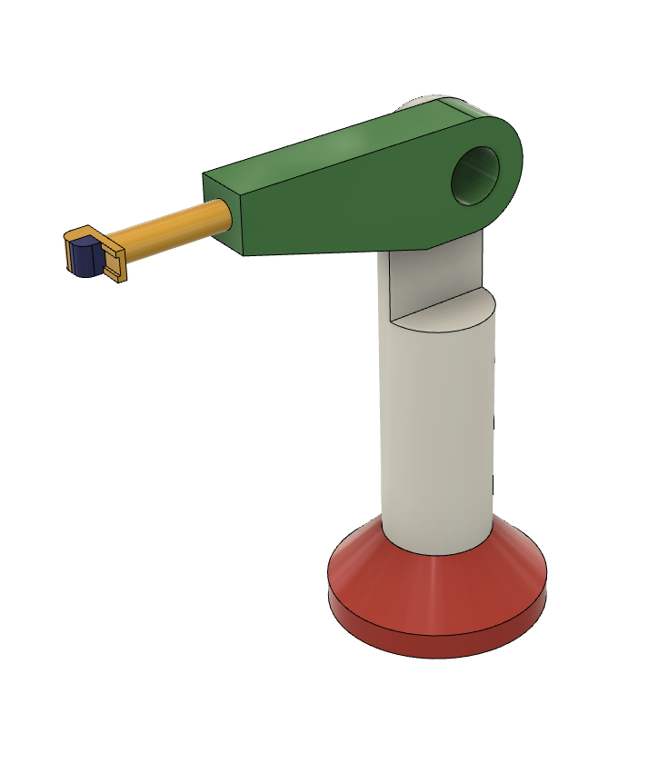
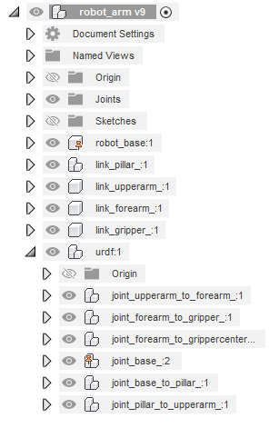
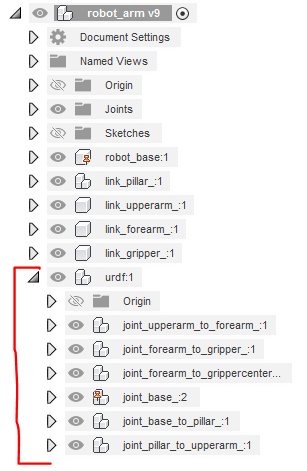
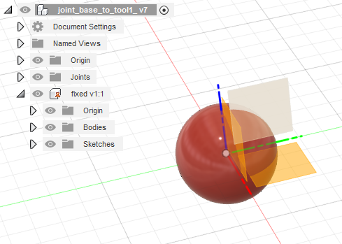
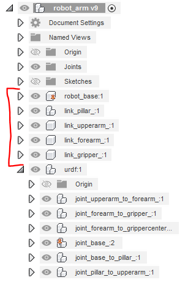

# STEP FILE CREATION

Create package with name "robot_arm"

Creation of urdf from step file with program urdf_from_step[link] is possible by adding properly named parts representing joints coordinates systems (right) to the robot shape CAD file (left). The addition of joint definitions is possible in any CAD software to the robot shape in CAD program-specific native format or already step file. In this example, we used Fusion 360 as a CAD program.

    

## Joint and link definitons

In urdf the kinematic chain is defined with links and joints betwen them. To create in 
Coordinate systems definitions

The subasembly with the name "urdf*" or "URDF*" needs to be created on the top level of the CAD tree.

    

"joint_PARENT_to_CHILD_*" where "PARENT" and "CHILD" are urdf links that the defined joint are connecting

"joint_base_*"

Joint definitions define the urdf kinematics chains by defining a child from the previous joint as a parent in the next one. The chain of definitions should be unbroken but can be branched to different end nodes.

The name of the part inside the joint subassembly defines the joint type. Currently folowing three joint types are supported fixed, revolute, and prismatic with corresponding parts names "fixed*", "revolute*" and "prismatic*".

The coordinate system of the subpart represents the joint coordinate system in urdf definitions. In the case of the revolute and prismatic axis, the x-axis is the rotation axis or the direction of translational movement.

### Joint CAD element

We created one CAD joint definition that we mated as an independent copy for all our joint definitions. For each copy, we changed the subassembly name to the required link names that it was connecting and we changed the internal part name to the joint type that it was representing. Because the Fusion 360 doesn't want to save the part with no shape to the STEP file we added the ball shape to the part representing the joint type. The shape in the joint subassembly is saved to the STEP file but it is later ignored in the urdf creation, so any user may choose his own desired shape inside of joints definitions. 

  

### Link shapes definitions

link_LINKNAME_*

Not all link names from urdf assembly definiton need to have shape definions

The shapes than are not hiarchily in any link they are automatily added to urdf base link

STL also exported automatic

Colors..

  