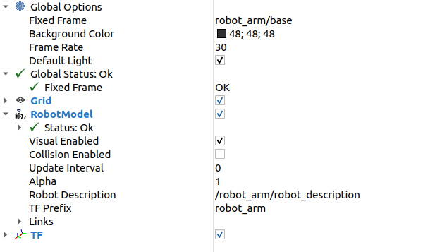

# RVIZ visualization

## Global Options

The created robot TF tree starts at "/PACKAGE_NAME/base" in the case of this example "/robot_arm/base". The transformation between rviz "map" or any other TF link on which we want to attach our kinematic tree can be implemented with a static TF publisher. 

For quick visualization we can just choose following setting:
* Fixed frame: /PACKAGE_NAME/base

## RoobotModel

* Robot description: /PACKAGE_NAME/robot_description
* TF prefix: PACKAGE_NAME

## TF

      